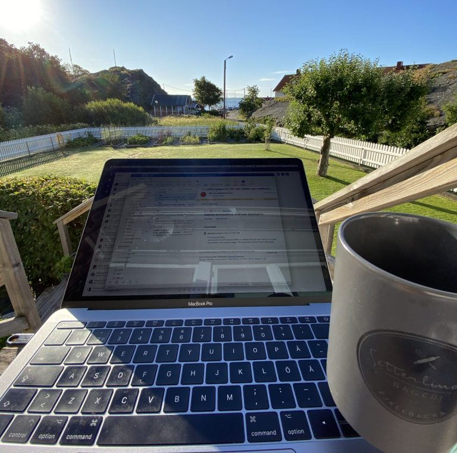
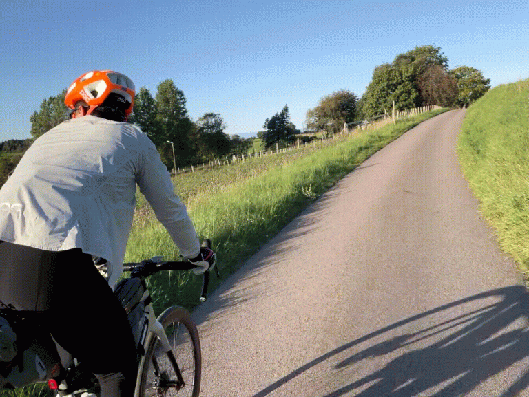

## About me​
As a seni--or user experience designer, I have expertise working with many types businesses to find solutions to issues and produce excellent UX. My daily motivation comes from guiding a group of people toward a single objective. I like to gather with others to generate ideas and work on problems(wether this being remote or in-person), while designating deep work time to concentrate on developing solutions and organizing future work.

## My experience
I’ve worked with a variety of businesses, from start-ups to large multinational corporations, in the fields of fintech, HR-tech, e-commerce (B2B & B2C), enterprise ordering systems, and others.

My prior experience covers all phases of the design process, from research and workshops to design systems and developer handoff. As part of my previous projects, I managed and took ownership of several design systems and scaled them.

I have project management and team leadership expertise. I’ve been in charge of a number of initiatives involving diverse business functions, business stakeholders, and customers. For team leadership, I have been mentoring and helping colleagues develop as designers. I appreciate feedback, and my leadership is open-minded and empathetic. I firmly believe that through working closely, leaders and their peers can develop together The process of learning from mistakes and improving oneself is a natural aspect of the development of any career. We should celebrate fails, learn and become better.

## Personal
I passionately believe in the sustainability of a work-life balance over the long run and in the right to make my own decisions. I encourage my peers to focus and take breaks when needed in order to live up to this. In order to live up to this, I spend my free time participating in sports like cross-country skiing, running, swimming, and cycling. Additionally, I’m a food, wine, and coffee nerd. These activities help me refuel so that I can give my all at work.

